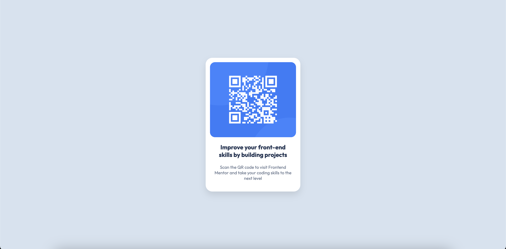

# Frontend Mentor - QR code component solution

This is a solution to the [QR code component challenge on Frontend Mentor](https://www.frontendmentor.io/challenges/qr-code-component-iux_sIO_H).

## Table of contents

- [Overview](#overview)
  - [Screenshots](#screenshots)
  - [Links](#links)
- [My process](#my-process)
  - [Built with](#built-with)
  - [What I learned](#what-i-learned)
- [Author](#author)

## Overview

### Screenshots

### Links

- [Solution URL](https://github.com/gus-t27/frontend-mentor-qr-code)
- [Live Site URL](https://your-live-site-url.com)

## My process

### Built with

- Semantic HTML5 markup
- CSS custom properties
- Flexbox

### What I learned

Back to basics vanilla HTML and CSS. I used this challenge to practice my HTML and CSS skills without any frameworks or libraries.

## Author

- Frontend Mentor - [@gus-t27](https://www.frontendmentor.io/profile/gus-t27)
